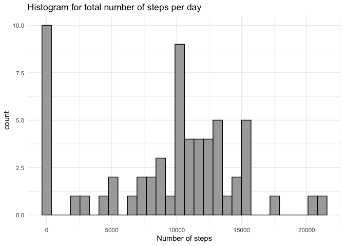
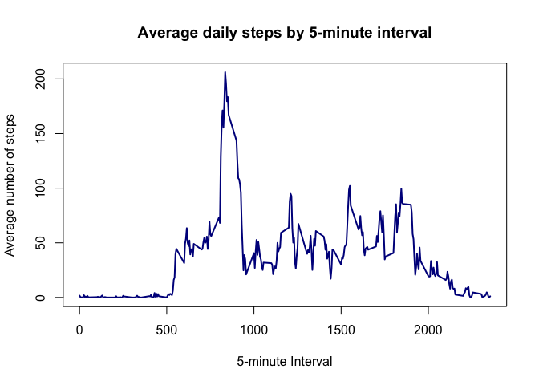
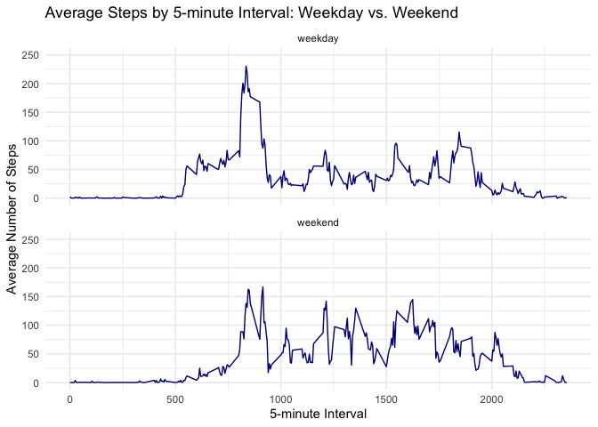

## Loading and preprocessing the data

```
## [1] 2304
```

```
## [1] 2304
```


## What is mean total number of steps taken per day?

```r
# Load necessary libraries
library(dplyr)  # For data manipulation
```

```
## 
## Attaching package: 'dplyr'
```

```
## The following objects are masked from 'package:stats':
## 
##     filter, lag
```

```
## The following objects are masked from 'package:base':
## 
##     intersect, setdiff, setequal, union
```

```r
library(ggplot2) # For data visualization

# Calculate the total number steps for each day
total_steps <- data %>%
  group_by(date) %>%
  summarize(total_steps = sum(steps, na.rm = TRUE))

# Histogram chart
ggplot(total_steps, aes(x=total_steps)) + geom_histogram(color="black", fill="darkgrey") + 
  labs(title = "Histogram for total number of steps per day",
       x = "Number of steps") +
  theme_minimal()
```

```
## `stat_bin()` using `bins = 30`. Pick better value with `binwidth`.
```

<!-- -->

```r
# report the mean value
sprintf("The mean total number of steps taken per day is : %.2f", mean(total_steps$total_steps))
```

```
## [1] "The mean total number of steps taken per day is : 9354.23"
```

```r
# report the median value
sprintf("The median total number of steps taken per day is : %.2f", median(total_steps$total_steps))
```

```
## [1] "The median total number of steps taken per day is : 10395.00"
```


## What is the average daily activity pattern?

```r
# Load necessary libraries
library(dplyr)  # For data manipulation

# Calculate the average steps for each interval across all days
average_steps <- data %>%
  group_by(interval) %>%
  summarize(avg_steps = mean(steps, na.rm = TRUE))

# Create the time series plot
plot(average_steps$interval, average_steps$avg_steps, type = "l",
     xlab = "5-minute Interval",
     ylab = "Average number of steps",
     main = "Average daily steps by 5-minute interval",
     col = "darkblue", lwd = 2)
```

<!-- -->

```r
# Find the 5-minute interval containing the maximum number of steps
max_steps <- with(average_steps, max(avg_steps))
max_intervals <- with(average_steps, interval[avg_steps==max_steps])
# Print it out
sprintf("The 5-minute interval containing the maximum number of steps is : %d", max_intervals)
```

```
## [1] "The 5-minute interval containing the maximum number of steps is : 835"
```


## Imputing missing values

```r
# Calculate the total number of missing values in the datasets; based on previous exploring, missing data only occurs in the column of steps; but here use complete.cases to capture any rows that have a na in it
total_missing <- sum(!complete.cases(data))

# Report the missing values
sprintf("The total number of missing values is : %d",
        total_missing)
```

```
## [1] "The total number of missing values is : 2304"
```

```r
# Fill missing data with the mean steps for each 5-minute interval
interval_means <- data %>%
  group_by(interval) %>%
  summarize(mean_steps = mean(steps, na.rm = TRUE))

# Join the interval means back to the original dataset and create new dataset
filled_data <- data %>%
  left_join(interval_means, by = "interval") %>%
  mutate(steps = ifelse(is.na(steps), mean_steps, steps)) %>%
  select(-mean_steps)  # Remove the mean column

# Calculate the total number steps for each day using the filled data
total_steps <- filled_data %>%
  group_by(date) %>%
  summarize(total_steps = sum(steps, na.rm = TRUE))

# Histogram chart
ggplot(total_steps, aes(x=total_steps)) + geom_histogram(color="darkgrey", fill="grey") + 
  labs(title = "Histogram for total number of steps per day",
       x = "Number of steps") +
  theme_minimal()
```

```
## `stat_bin()` using `bins = 30`. Pick better value with `binwidth`.
```

<!-- -->

```r
# report the mean value
sprintf("The mean total number of steps taken per day is : %.2f", mean(total_steps$total_steps))
```

```
## [1] "The mean total number of steps taken per day is : 10766.19"
```

```r
# report the median value
sprintf("The median total number of steps taken per day is : %.2f", median(total_steps$total_steps))
```

```
## [1] "The median total number of steps taken per day is : 10766.19"
```


## Are there differences in activity patterns between weekdays and weekends?

```r
# Load libraries
library(dplyr)

# Create a new variable 'day' indicating "weekday" or "weekend"
filled_data <- filled_data %>%
  mutate(day = ifelse(weekdays(as.Date(date)) %in% c("Saturday", "Sunday"), "weekend", "weekday"))

# Convert 'data' to a factor
filled_data$day <- as.factor(filled_data$day)

# Calculate the average steps for each interval and day
average_steps_by_day <- filled_data %>%
  group_by(interval, day) %>%
  summarize(avg_steps = mean(steps, na.rm = TRUE))
```

```
## `summarise()` has grouped output by 'interval'. You can override using the
## `.groups` argument.
```

```r
# Load ggplot2
library(ggplot2)

# Create the panel plot
ggplot(average_steps_by_day, aes(x = interval, y = avg_steps)) +
  geom_line(color="darkblue") +
  facet_wrap(~ day, ncol = 1, scales = "free_y") +
  coord_cartesian(ylim = c(0,max(average_steps_by_day$avg_steps)+20)) + 
  labs(x = "5-minute Interval", y = "Average Number of Steps",
       title = "Average Steps by 5-minute Interval: Weekday vs. Weekend") +
  theme_minimal()
```

<!-- -->

